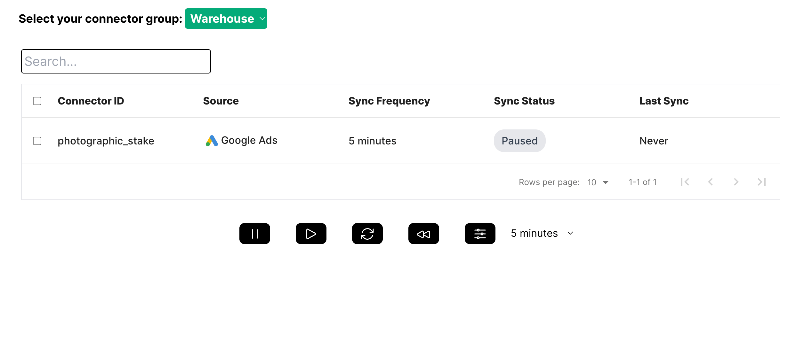

## Sixtran

<p align="center">
  
</p>

Sixtran was built to improve the user experience of data engineers working with [Fivetran](https://www.fivetran.com). The application brings simplicity and cost-effectiveness to data integration.

This is a legacy project for which we implemented tests and translated the codebase into TypeScript.


## Screenshots

<p align="center">
  
  
</p>


## Getting started

Except for the regular suspects; git, Node, npm, you need these things to work on the Sixtran app.

1. Clone the repo

```
git clone git@github.com:Elsass1/Sixtran.git
```

2. Install dependencies
```
npm install
```

3. Start development server
```
npm run dev
```


### Credentials needed
- You will need to create a trial account on [Fivetran](https://www.fivetran.com/) to obtain the API Key & Secret.


## Tech Stack
* [NextJS](https://nextjs.org)
* [Tailwind](https://tailwindcss.com)
* [TypeScript](https://www.typescriptlang.org)
* [Vitest](https://vitest.dev)
* [Cypress](https://www.cypress.io)
* [Fivetran](https://www.fivetran.com)
* [Bigquery](https://cloud.google.com/bigquery)


## Developers
* Sevim Tas Joseph [GitHub](https://github.com/sevtechcodes) - [LinkedIn](https://www.linkedin.com/in/sevimjoseph)
* Jemima Cecil [GitHub](https://github.com/jemimacecil) - [LinkedIn](https://www.linkedin.com/in/jemima-cecil-5602211a0/)
* Brice Fromm [GitHub](https://github.com/Elsass1) - [LinkedIn](https://www.linkedin.com/in/frommbrice)


